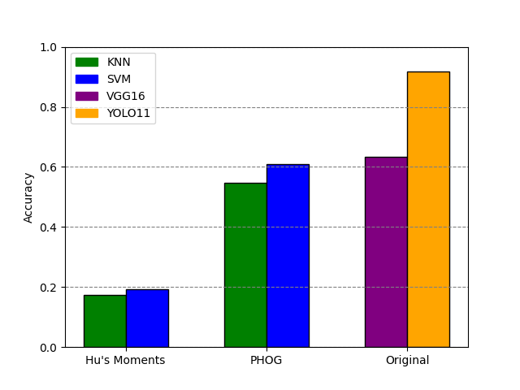
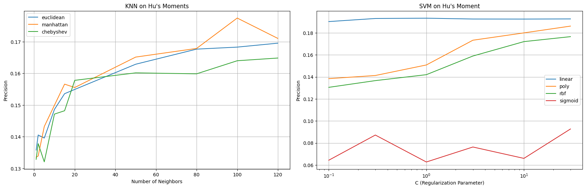
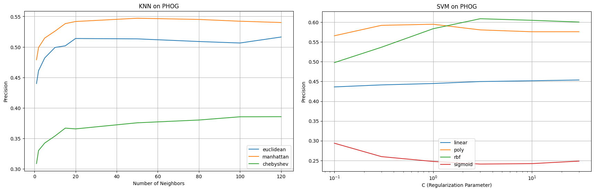
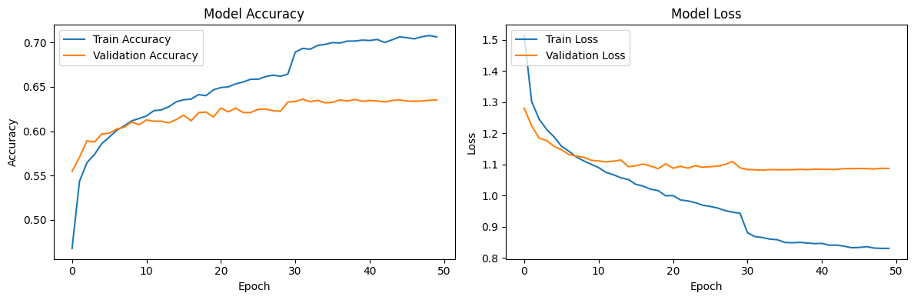
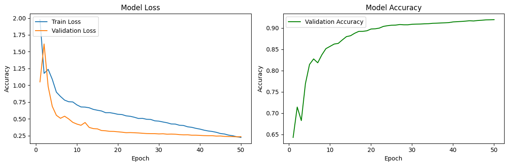

# Classical-Object-Classifier
## Description:
This mini projects compares performance of multiple global feature extraction and classification methods on a pretrained dataset.
- Dataset: CIFAR-10 (60 000 images divided into 10 classes)
- Feature extraction: Hu's Moments, PHOG (pyramid histogram of oriented gradients) (for KNN and SVM)
- Classification methods: KNN (k-nearest neighbours), SVM (supported vector machine), VGG16, and YOLO11.
## Result:
After training on CIFAR-10 dataset, this is the result:

## Tuning Hyper Parameter and Training Process:
Tuning Hyper Parameter and Training Process are recorded as follow:
- Tuning of KNN and SVM models on data extracted using Hu's Moments:

- Tuning of KNN and SVM models on data extracted using PHOG:

- Transfer learning process of VGG16 model:

- Transfer learning process of YOLO11x-cls model:
